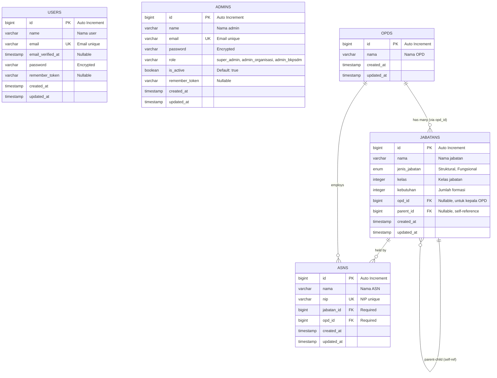

# Entity Relationship Diagram (ERD) - SIPETA

**SIPETA** adalah Sistem Informasi Peta Jabatan ASN untuk mengelola data organisasi, jabatan, dan pegawai ASN.

## 📊 Diagram Database



### Diagram ASCII (Alternatif)

```
╔══════════════════════════════════════════════════════════════════════════════════╗
║                          DATABASE SCHEMA - SIPETA                                 ║
╚══════════════════════════════════════════════════════════════════════════════════╝

┏━━━━━━━━━━━━━━━━━━━┓
┃      USERS        ┃
┣━━━━━━━━━━━━━━━━━━━┫
┃ 🔑 id             ┃
┃ │  name           ┃
┃ │  email ⚡       ┃
┃ │  password       ┃
┃ │  ...            ┃
┗━━━━━━━━━━━━━━━━━━━┛

┏━━━━━━━━━━━━━━━━━━━┓
┃     ADMINS        ┃
┣━━━━━━━━━━━━━━━━━━━┫
┃ 🔑 id             ┃
┃ │  name           ┃
┃ │  email ⚡       ┃
┃ │  password       ┃
┃ │  role           ┃
┃ │  is_active      ┃
┗━━━━━━━━━━━━━━━━━━━┛


╔════════════════════════════════════════════════════════════════════════════════╗
║                           RELASI UTAMA DATABASE                                 ║
╚════════════════════════════════════════════════════════════════════════════════╝

     ┏━━━━━━━━━━━━━━━━━━━━┓          ┏━━━━━━━━━━━━━━━━━━━━━━━━━┓          ┏━━━━━━━━━━━━━━━━━━━┓
     ┃       OPDS         ┃          ┃       JABATANS          ┃          ┃       ASNS        ┃
     ┃  (Organisasi       ┃          ┃      (Jabatan)          ┃          ┃   (Pegawai ASN)   ┃
     ┃   Perangkat        ┃          ┃                         ┃          ┃                   ┃
     ┃    Daerah)         ┃          ┃                         ┃          ┃                   ┃
     ┣━━━━━━━━━━━━━━━━━━━━┫          ┣━━━━━━━━━━━━━━━━━━━━━━━━━┫          ┣━━━━━━━━━━━━━━━━━━━┫
     ┃ 🔑 id              ┃◄─────┐   ┃ 🔑 id                   ┃◄─────┐   ┃ 🔑 id             ┃
     ┃ │  nama            ┃      │   ┃ │  nama                 ┃      │   ┃ │  nama           ┃
     ┃ │  created_at      ┃      │   ┃ │  jenis_jabatan        ┃      │   ┃ │  nip ⚡        ┃
     ┃ │  updated_at      ┃      │   ┃ │  kelas                ┃      │   ┃ 🔗 jabatan_id    ┃─────┐
     ┗━━━━━━━━━━━━━━━━━━━━┛      │   ┃ │  kebutuhan            ┃      │   ┃ 🔗 opd_id        ┃──┐  │
            │                    │   ┃ 🔗 opd_id (null)        ┃──────┘   ┃ │  created_at     ┃  │  │
            │                    │   ┃ 🔗 parent_id (null)     ┃◄──┐      ┃ │  updated_at     ┃  │  │
            │                    │   ┃ │  created_at           ┃   │      ┗━━━━━━━━━━━━━━━━━━━┛  │  │
            │                    │   ┃ │  updated_at           ┃   │                             │  │
            │                    │   ┗━━━━━━━━━━━━━━━━━━━━━━━━━┛   │                             │  │
            │                    │            │                    │                             │  │
            │                    │            └────────────────────┘                             │  │
            │                    │          (self-referencing:                                   │  │
            │                    │           parent → child)                                     │  │
            │                    │                                                                │  │
            └────────────────────┼────────────────────────────────────────────────────────────────┘  │
                                 │                                                                   │
                                 └───────────────────────────────────────────────────────────────────┘

                                 
╔═══════════════════════════════════════════════════════════════════════════════╗
║  LEGEND                                                                        ║
╠═══════════════════════════════════════════════════════════════════════════════╣
║  🔑 = Primary Key (PK)                                                        ║
║  🔗 = Foreign Key (FK)                                                        ║
║  ⚡ = Unique Index                                                            ║
║  ─────► = One-to-Many Relationship                                           ║
║  (null) = Nullable Field                                                      ║
╚═══════════════════════════════════════════════════════════════════════════════╝
```

---

## 📋 Deskripsi Tabel

### 1. **USERS**
Tabel untuk autentikasi user standar Laravel.

| Kolom | Tipe | Keterangan |
|-------|------|------------|
| 🔑 **id** | BIGINT | Primary Key, Auto Increment |
| name | VARCHAR(255) | Nama user |
| email | VARCHAR(255) | Email (unique) |
| email_verified_at | TIMESTAMP | Waktu verifikasi email (nullable) |
| password | VARCHAR(255) | Password terenkripsi |
| remember_token | VARCHAR(100) | Token untuk "Remember Me" (nullable) |
| created_at | TIMESTAMP | Waktu dibuat |
| updated_at | TIMESTAMP | Waktu diupdate |

---

### 2. **ADMINS**
Tabel untuk administrator sistem dengan role-based access control.

| Kolom | Tipe | Keterangan |
|-------|------|------------|
| 🔑 **id** | BIGINT | Primary Key, Auto Increment |
| name | VARCHAR(255) | Nama admin |
| email | VARCHAR(255) | Email (unique) |
| password | VARCHAR(255) | Password terenkripsi |
| role | VARCHAR(255) | Role admin (default: 'admin') |
| is_active | BOOLEAN | Status aktif (default: true) |
| remember_token | VARCHAR(100) | Token untuk "Remember Me" (nullable) |
| created_at | TIMESTAMP | Waktu dibuat |
| updated_at | TIMESTAMP | Waktu diupdate |

**Role yang tersedia:**
- `super_admin` - Akses penuh ke semua fitur
- `admin_organisasi` - Mengelola OPD dan Jabatan
- `admin_bkpsdm` - Mengelola data ASN

---

### 3. **OPDS**
Tabel untuk menyimpan Organisasi Perangkat Daerah (OPD).

| Kolom | Tipe | Keterangan |
|-------|------|------------|
| 🔑 **id** | BIGINT | Primary Key, Auto Increment |
| nama | VARCHAR(255) | Nama OPD (contoh: Dinas Pendidikan) |
| created_at | TIMESTAMP | Waktu dibuat |
| updated_at | TIMESTAMP | Waktu diupdate |

**Contoh OPD:**
- Dinas Pendidikan
- Dinas Kesehatan
- BKPSDM (Badan Kepegawaian dan Pengembangan SDM)
- Sekretariat Daerah

---

### 4. **JABATANS**
Tabel untuk menyimpan jabatan dengan struktur hierarki (self-referencing).

| Kolom | Tipe | Keterangan |
|-------|------|------------|
| 🔑 **id** | BIGINT | Primary Key, Auto Increment |
| nama | VARCHAR(255) | Nama jabatan |
| jenis_jabatan | ENUM | Jenis: 'Struktural' atau 'Fungsional' |
| kelas | INTEGER | Kelas jabatan |
| kebutuhan | INTEGER | Jumlah kebutuhan formasi |
| 🔗 **opd_id** | BIGINT | Foreign Key ke OPDS (nullable) |
| 🔗 **parent_id** | BIGINT | Foreign Key ke JABATANS (nullable, self-ref) |
| created_at | TIMESTAMP | Waktu dibuat |
| updated_at | TIMESTAMP | Waktu diupdate |

**Jenis Jabatan:**
- **Struktural** - Jabatan kepemimpinan (Kepala Dinas, Kabid, Kasubid, dll)
- **Fungsional** - Jabatan teknis/fungsional (Guru, Dokter, Analis, dll)

**Struktur Hierarki:**
- Jabatan dengan `opd_id` terisi = **Jabatan Kepala OPD** (root)
- Jabatan dengan `parent_id` terisi = **Sub-jabatan** dari jabatan parent
- Self-referencing memungkinkan hierarki tidak terbatas

**Contoh Hierarki:**
```
Kepala Dinas Pendidikan (opd_id=1, parent_id=null)
  └── Sekretaris (opd_id=null, parent_id=1)
      ├── Kepala Sub Bagian Umum (parent_id=2)
      └── Kepala Sub Bagian Keuangan (parent_id=2)
  └── Kabid Pendidikan Dasar (opd_id=null, parent_id=1)
      └── Kasubid SD (parent_id=5)
```

---

### 5. **ASNS**
Tabel untuk menyimpan data Aparatur Sipil Negara (ASN/Pegawai).

| Kolom | Tipe | Keterangan |
|-------|------|------------|
| 🔑 **id** | BIGINT | Primary Key, Auto Increment |
| nama | VARCHAR(255) | Nama lengkap ASN |
| nip | VARCHAR(30) | NIP (Nomor Induk Pegawai) - unique |
| 🔗 **jabatan_id** | BIGINT | Foreign Key ke JABATANS (required) |
| 🔗 **opd_id** | BIGINT | Foreign Key ke OPDS (required) |
| created_at | TIMESTAMP | Waktu dibuat |
| updated_at | TIMESTAMP | Waktu diupdate |

**Catatan:**
- Setiap ASN harus memiliki jabatan dan OPD
- NIP bersifat unique untuk setiap ASN
- Satu jabatan dapat dipegang oleh lebih dari satu ASN

---

## 🔗 Relasi Antar Tabel

### 1. **OPDS → JABATANS** (One-to-Many)
- **Kardinalitas**: 1 : N
- **Foreign Key**: `jabatans.opd_id` → `opds.id`
- **Keterangan**: Satu OPD memiliki banyak jabatan kepala (root positions)
- **Nullable**: Ya (hanya jabatan kepala yang punya opd_id)

```sql
ALTER TABLE jabatans 
ADD CONSTRAINT fk_jabatans_opd 
FOREIGN KEY (opd_id) REFERENCES opds(id);
```

---

### 2. **JABATANS → JABATANS** (Self-Referencing, One-to-Many)
- **Kardinalitas**: 1 : N (recursive)
- **Foreign Key**: `jabatans.parent_id` → `jabatans.id`
- **Keterangan**: Hierarki jabatan (atasan-bawahan) tanpa batas level
- **Nullable**: Ya (jabatan root tidak punya parent)

```sql
ALTER TABLE jabatans 
ADD CONSTRAINT fk_jabatans_parent 
FOREIGN KEY (parent_id) REFERENCES jabatans(id) 
ON DELETE CASCADE;
```

**Karakteristik:**
- Parent dapat memiliki banyak children
- Children hanya memiliki satu parent
- Root jabatan: `parent_id = NULL` dan `opd_id IS NOT NULL`
- Mendukung unlimited hierarchy depth

---

### 3. **JABATANS → ASNS** (One-to-Many)
- **Kardinalitas**: 1 : N
- **Foreign Key**: `asns.jabatan_id` → `jabatans.id`
- **Keterangan**: Satu jabatan dapat dipegang oleh banyak ASN
- **Nullable**: Tidak (required)

```sql
ALTER TABLE asns 
ADD CONSTRAINT fk_asns_jabatan 
FOREIGN KEY (jabatan_id) REFERENCES jabatans(id);
```

---

### 4. **OPDS → ASNS** (One-to-Many)
- **Kardinalitas**: 1 : N
- **Foreign Key**: `asns.opd_id` → `opds.id`
- **Keterangan**: Satu OPD memiliki banyak ASN (pegawai)
- **Nullable**: Tidak (required)

```sql
ALTER TABLE asns 
ADD CONSTRAINT fk_asns_opd 
FOREIGN KEY (opd_id) REFERENCES opds(id);
```

---

## 🎯 Business Rules

### Aturan Jabatan:
1. Jabatan **root** (kepala OPD) harus memiliki `opd_id` dan `parent_id = NULL`
2. Jabatan **sub-ordinat** harus memiliki `parent_id` dan `opd_id = NULL`
3. Hierarki jabatan tidak terbatas kedalaman levelnya
4. Satu jabatan bisa dipegang oleh lebih dari satu ASN (untuk formasi)

### Aturan ASN:
1. Setiap ASN **wajib** memiliki jabatan dan OPD
2. NIP harus unique untuk setiap ASN
3. ASN mengacu langsung ke OPD untuk kemudahan query

### Aturan Admin:
1. Super Admin: akses penuh
2. Admin Organisasi: hanya bisa mengelola OPD dan Jabatan
3. Admin BKPSDM: hanya bisa mengelola data ASN

---

## 📝 Contoh Data

### Contoh OPD:
```
ID | Nama
---|---------------------------
1  | Dinas Pendidikan
2  | Dinas Kesehatan
3  | BKPSDM
```

### Contoh Jabatan (Hierarki):
```
ID | Nama                        | Jenis      | Kelas | OPD_ID | Parent_ID
---|----------------------------|-----------|-------|--------|----------
1  | Kepala Dinas Pendidikan     | Struktural | 14    | 1      | NULL
2  | Sekretaris Dinas            | Struktural | 12    | NULL   | 1
3  | Kasubag Umum                | Struktural | 9     | NULL   | 2
4  | Kasubag Keuangan            | Struktural | 9     | NULL   | 2
5  | Kabid Pendidikan Dasar      | Struktural | 12    | NULL   | 1
6  | Kasubid SD                  | Struktural | 9     | NULL   | 5
7  | Guru SD                     | Fungsional | 8     | NULL   | 6
```

### Contoh ASN:
```
ID | Nama              | NIP                | Jabatan_ID | OPD_ID
---|-------------------|-------------------|------------|-------
1  | Dr. Ahmad Susilo  | 198501012010011001 | 1          | 1
2  | Budi Santoso      | 198705152010011002 | 2          | 1
3  | Siti Nurhaliza    | 199001012015022001 | 7          | 1
```

---

## 🔍 Query Contoh

### 1. Mendapatkan semua ASN di suatu OPD:
```sql
SELECT a.*, j.nama as nama_jabatan
FROM asns a
JOIN jabatans j ON a.jabatan_id = j.id
WHERE a.opd_id = 1;
```

### 2. Mendapatkan hierarki jabatan di suatu OPD:
```sql
WITH RECURSIVE jabatan_tree AS (
  -- Anchor: ambil root jabatan
  SELECT id, nama, parent_id, opd_id, 0 as level
  FROM jabatans
  WHERE opd_id = 1 AND parent_id IS NULL
  
  UNION ALL
  
  -- Recursive: ambil children
  SELECT j.id, j.nama, j.parent_id, j.opd_id, jt.level + 1
  FROM jabatans j
  JOIN jabatan_tree jt ON j.parent_id = jt.id
)
SELECT * FROM jabatan_tree
ORDER BY level, id;
```

### 3. Mendapatkan jumlah ASN per jabatan:
```sql
SELECT j.nama, COUNT(a.id) as jumlah_asn, j.kebutuhan
FROM jabatans j
LEFT JOIN asns a ON j.id = a.jabatan_id
GROUP BY j.id
ORDER BY j.nama;
```

### 4. Cek formasi yang masih kosong:
```sql
SELECT j.nama, j.kebutuhan, COUNT(a.id) as terisi, 
       (j.kebutuhan - COUNT(a.id)) as kosong
FROM jabatans j
LEFT JOIN asns a ON j.id = a.jabatan_id
GROUP BY j.id
HAVING kosong > 0;
```

---

## 🎨 Keterangan Icon

- 🔑 **Primary Key** - Identifier unik untuk setiap record
- 🔗 **Foreign Key** - Referensi ke tabel lain
- ⚡ **Index** - Field yang diindex untuk performa
- 🔒 **Unique** - Nilai harus unik

---

## 📚 Referensi

- Framework: **Laravel 10+**
- Database: **MySQL 8.0+**
- ORM: **Eloquent**

**File Migration:**
- `database/migrations/2025_07_29_140046_create_opds_table.php`
- `database/migrations/2025_11_18_013939_remove_bagian_convert_to_jabatan_hierarchy.php`
- `database/migrations/2025_07_29_140156_create_asns_table.php`
- `database/migrations/2025_11_17_053231_create_admins_table.php`

**Models:**
- `app/Models/Opd.php`
- `app/Models/Jabatan.php`
- `app/Models/Asn.php`
- `app/Models/Admin.php`

---

*Dokumentasi dibuat: 19 November 2025*
*Sistem: SIPETA (Sistem Informasi Peta Jabatan ASN)*
