# Rancangan Alur Sistem - SIPETA

**SIPETA** (Sistem Informasi Peta Jabatan ASN)  
Sistem untuk mengelola peta jabatan, organisasi, dan kepegawaian ASN di lingkungan pemerintah daerah.

---

## 📋 Daftar Isi

- [1. Diagram Alur Sistem](#1-diagram-alur-sistem)
- [2. Alur Proses Bisnis](#2-alur-proses-bisnis)
- [3. Use Case Diagram](#3-use-case-diagram)
- [4. Activity Diagram](#4-activity-diagram)
- [5. Sequence Diagram](#5-sequence-diagram)
- [6. State Diagram](#6-state-diagram)

---

## 1. Diagram Alur Sistem

### 1.1 Arsitektur Sistem

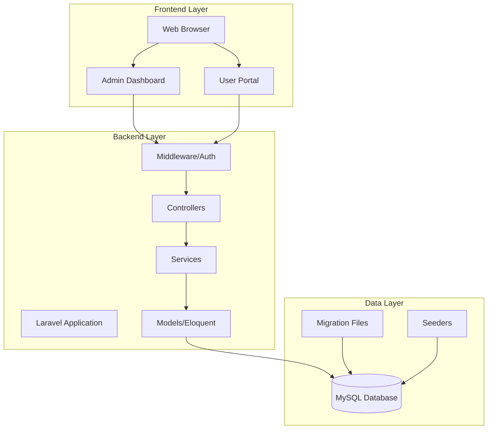
```mermaid
graph TB
    subgraph "Frontend Layer"
        A[Web Browser]
        B[Admin Dashboard]
        C[User Portal]
    end
    
    subgraph "Backend Layer"
        D[Laravel Application]
        E[Controllers]
        F[Models/Eloquent]
        G[Services]
        H[Middleware/Auth]
    end
    
    subgraph "Data Layer"
        I[(MySQL Database)]
        J[Migration Files]
        K[Seeders]
    end
    
    A --> B
    A --> C
    B --> H
    C --> H
    H --> E
    E --> G
    G --> F
    F --> I
    J --> I
    K --> I
```

### 1.2 Alur Data Utama

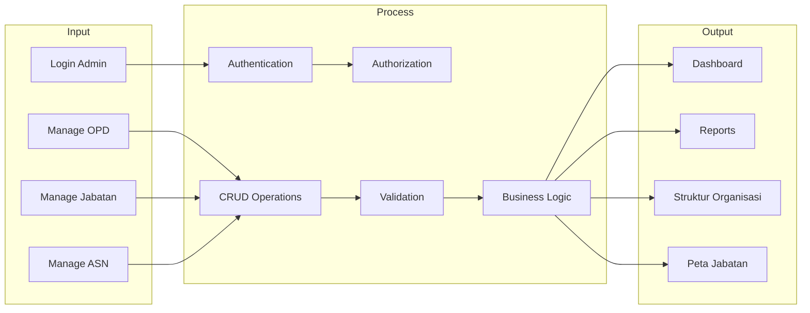
```mermaid
flowchart LR
    subgraph Input
        A1[Login Admin]
        A2[Manage OPD]
        A3[Manage Jabatan]
        A4[Manage ASN]
    end
    
    subgraph Process
        B1[Authentication]
        B2[Authorization]
        B3[CRUD Operations]
        B4[Validation]
        B5[Business Logic]
    end
    
    subgraph Output
        C1[Dashboard]
        C2[Reports]
        C3[Struktur Organisasi]
        C4[Peta Jabatan]
    end
    
    A1 --> B1
    B1 --> B2
    A2 --> B3
    A3 --> B3
    A4 --> B3
    B3 --> B4
    B4 --> B5
    B5 --> C1
    B5 --> C2
    B5 --> C3
    B5 --> C4
```

---

## 2. Alur Proses Bisnis

### 2.1 Proses Autentikasi & Otorisasi

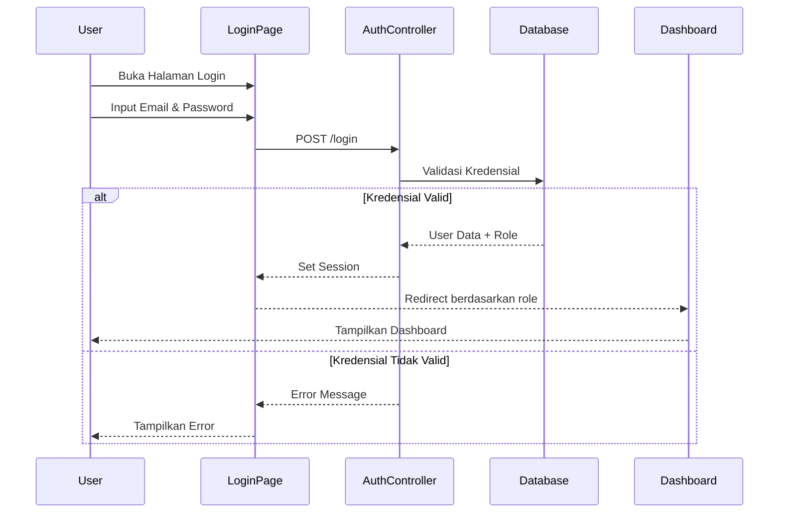
```mermaid
sequenceDiagram
    participant User
    participant LoginPage
    participant AuthController
    participant Database
    participant Dashboard
    
    User->>LoginPage: Buka Halaman Login
    User->>LoginPage: Input Email & Password
    LoginPage->>AuthController: POST /login
    AuthController->>Database: Validasi Kredensial
    
    alt Kredensial Valid
        Database-->>AuthController: User Data + Role
        AuthController-->>LoginPage: Set Session
        LoginPage-->>Dashboard: Redirect berdasarkan role
        Dashboard-->>User: Tampilkan Dashboard
    else Kredensial Tidak Valid
        AuthController-->>LoginPage: Error Message
        LoginPage-->>User: Tampilkan Error
    end
```

**Tiga Jenis Pengguna:**
1. **Super Admin** → Akses penuh semua modul
2. **Admin Organisasi** → Kelola OPD dan Jabatan
3. **Admin BKPSDM** → Kelola ASN

---

### 2.2 Proses Pengelolaan OPD

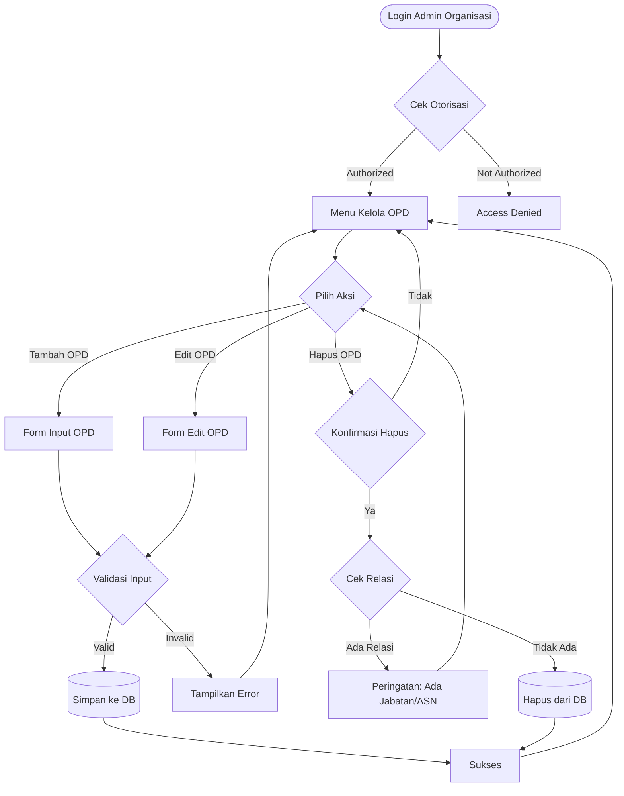
```mermaid
flowchart TD
    Start([Login Admin Organisasi]) --> CheckAuth{Cek Otorisasi}
    CheckAuth -->|Authorized| MenuOPD[Menu Kelola OPD]
    CheckAuth -->|Not Authorized| Error[Access Denied]
    
    MenuOPD --> ChooseAction{Pilih Aksi}
    
    ChooseAction -->|Tambah OPD| FormTambah[Form Input OPD]
    ChooseAction -->|Edit OPD| FormEdit[Form Edit OPD]
    ChooseAction -->|Hapus OPD| ConfirmDelete{Konfirmasi Hapus}
    
    FormTambah --> ValidateInput{Validasi Input}
    FormEdit --> ValidateInput
    
    ValidateInput -->|Valid| SaveDB[(Simpan ke DB)]
    ValidateInput -->|Invalid| ShowError[Tampilkan Error]
    
    ConfirmDelete -->|Ya| CheckRelation{Cek Relasi}
    ConfirmDelete -->|Tidak| MenuOPD
    
    CheckRelation -->|Ada Relasi| ShowWarning[Peringatan: Ada Jabatan/ASN]
    CheckRelation -->|Tidak Ada| DeleteDB[(Hapus dari DB)]
    
    SaveDB --> Success[Sukses]
    DeleteDB --> Success
    ShowError --> MenuOPD
    ShowWarning --> ChooseAction
    Success --> MenuOPD
```

**Business Rules:**
- OPD tidak dapat dihapus jika masih memiliki Jabatan atau ASN
- Nama OPD harus unik
- Validasi minimal 3 karakter untuk nama OPD

---

### 2.3 Proses Pengelolaan Jabatan (Hierarki)

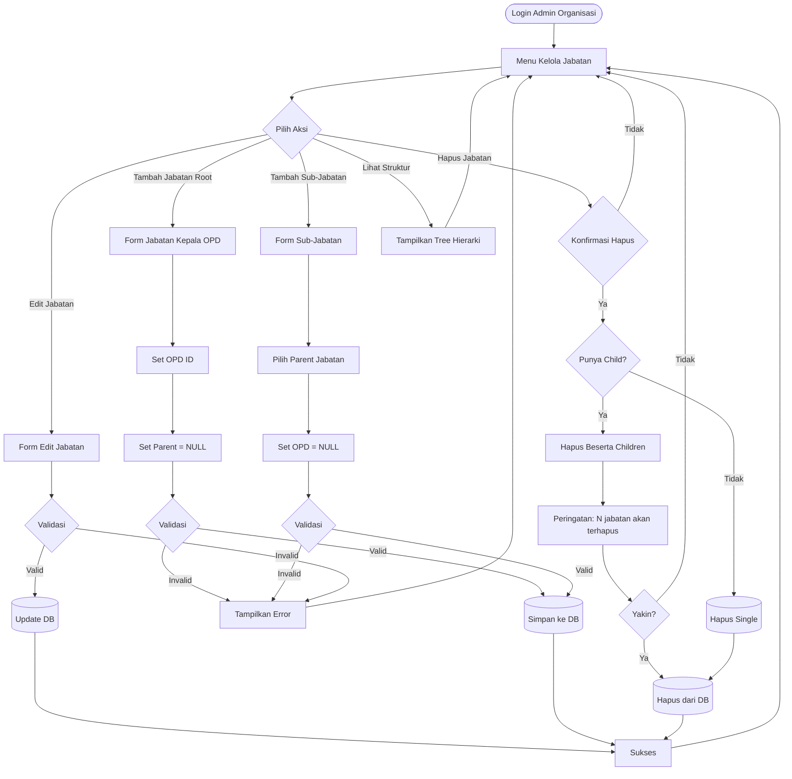
```mermaid
flowchart TD
    Start([Login Admin Organisasi]) --> MenuJabatan[Menu Kelola Jabatan]
    
    MenuJabatan --> ChooseAction{Pilih Aksi}
    
    ChooseAction -->|Tambah Jabatan Root| FormRoot[Form Jabatan Kepala OPD]
    ChooseAction -->|Tambah Sub-Jabatan| FormSub[Form Sub-Jabatan]
    ChooseAction -->|Edit Jabatan| FormEdit[Form Edit Jabatan]
    ChooseAction -->|Hapus Jabatan| ConfirmDelete{Konfirmasi Hapus}
    ChooseAction -->|Lihat Struktur| ViewTree[Tampilkan Tree Hierarki]
    
    FormRoot --> SetOPD[Set OPD ID]
    SetOPD --> SetParentNull[Set Parent = NULL]
    SetParentNull --> ValidateRoot{Validasi}
    
    FormSub --> SelectParent[Pilih Parent Jabatan]
    SelectParent --> SetOPDNull[Set OPD = NULL]
    SetOPDNull --> ValidateSub{Validasi}
    
    ValidateRoot -->|Valid| SaveDB[(Simpan ke DB)]
    ValidateSub -->|Valid| SaveDB
    ValidateRoot -->|Invalid| ShowError[Tampilkan Error]
    ValidateSub -->|Invalid| ShowError
    
    FormEdit --> ValidateEdit{Validasi}
    ValidateEdit -->|Valid| UpdateDB[(Update DB)]
    ValidateEdit -->|Invalid| ShowError
    
    ConfirmDelete -->|Ya| CheckChildren{Punya Child?}
    ConfirmDelete -->|Tidak| MenuJabatan
    
    CheckChildren -->|Ya| DeleteCascade[Hapus Beserta Children]
    CheckChildren -->|Tidak| DeleteSingle[(Hapus Single)]
    
    DeleteCascade --> WarningMessage[Peringatan: N jabatan akan terhapus]
    WarningMessage --> FinalConfirm{Yakin?}
    FinalConfirm -->|Ya| DeleteDB[(Hapus dari DB)]
    FinalConfirm -->|Tidak| MenuJabatan
    
    DeleteSingle --> DeleteDB
    UpdateDB --> Success[Sukses]
    SaveDB --> Success
    DeleteDB --> Success
    Success --> MenuJabatan
    ShowError --> MenuJabatan
    ViewTree --> MenuJabatan
```

**Business Rules:**
- Jabatan Root: `opd_id` wajib diisi, `parent_id` = NULL
- Sub-Jabatan: `parent_id` wajib diisi, `opd_id` = NULL
- Jabatan dengan children tidak bisa dihapus kecuali cascade
- Kelas jabatan harus valid (berdasarkan PP tentang kelas jabatan)
- Jenis jabatan: Struktural atau Fungsional

---

### 2.4 Proses Pengelolaan ASN

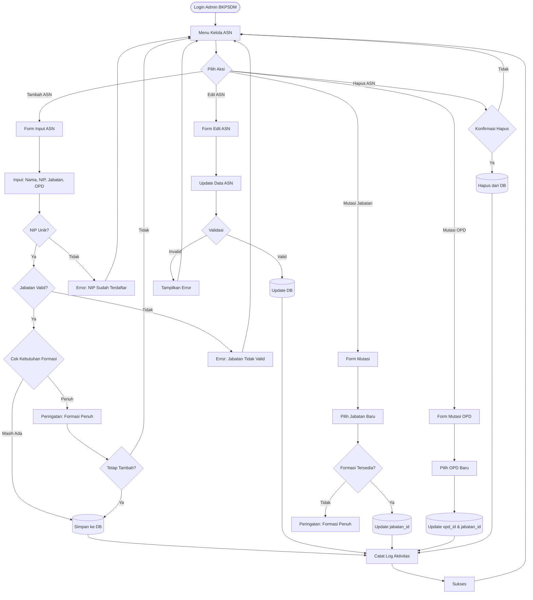
```mermaid
flowchart TD
    Start([Login Admin BKPSDM]) --> MenuASN[Menu Kelola ASN]
    
    MenuASN --> ChooseAction{Pilih Aksi}
    
    ChooseAction -->|Tambah ASN| FormTambah[Form Input ASN]
    ChooseAction -->|Edit ASN| FormEdit[Form Edit ASN]
    ChooseAction -->|Hapus ASN| ConfirmDelete{Konfirmasi Hapus}
    ChooseAction -->|Mutasi Jabatan| FormMutasi[Form Mutasi]
    ChooseAction -->|Mutasi OPD| FormMutasiOPD[Form Mutasi OPD]
    
    FormTambah --> InputData[Input: Nama, NIP, Jabatan, OPD]
    InputData --> CheckNIP{NIP Unik?}
    
    CheckNIP -->|Ya| CheckJabatan{Jabatan Valid?}
    CheckNIP -->|Tidak| ErrorNIP[Error: NIP Sudah Terdaftar]
    
    CheckJabatan -->|Ya| CheckFormasi{Cek Kebutuhan Formasi}
    CheckJabatan -->|Tidak| ErrorJabatan[Error: Jabatan Tidak Valid]
    
    CheckFormasi -->|Masih Ada| SaveDB[(Simpan ke DB)]
    CheckFormasi -->|Penuh| WarningFormasi[Peringatan: Formasi Penuh]
    WarningFormasi --> ForceAdd{Tetap Tambah?}
    ForceAdd -->|Ya| SaveDB
    ForceAdd -->|Tidak| MenuASN
    
    FormEdit --> UpdateData[Update Data ASN]
    UpdateData --> ValidateUpdate{Validasi}
    ValidateUpdate -->|Valid| UpdateDB[(Update DB)]
    ValidateUpdate -->|Invalid| ShowError[Tampilkan Error]
    
    FormMutasi --> SelectNewJabatan[Pilih Jabatan Baru]
    SelectNewJabatan --> CheckAvailability{Formasi Tersedia?}
    CheckAvailability -->|Ya| UpdateJabatan[(Update jabatan_id)]
    CheckAvailability -->|Tidak| WarningMutasi[Peringatan: Formasi Penuh]
    
    FormMutasiOPD --> SelectNewOPD[Pilih OPD Baru]
    SelectNewOPD --> UpdateOPDJabatan[(Update opd_id & jabatan_id)]
    
    ConfirmDelete -->|Ya| DeleteDB[(Hapus dari DB)]
    ConfirmDelete -->|Tidak| MenuASN
    
    SaveDB --> LogActivity[Catat Log Aktivitas]
    UpdateDB --> LogActivity
    UpdateJabatan --> LogActivity
    UpdateOPDJabatan --> LogActivity
    DeleteDB --> LogActivity
    
    LogActivity --> Success[Sukses]
    Success --> MenuASN
    ErrorNIP --> MenuASN
    ErrorJabatan --> MenuASN
    ShowError --> MenuASN
```

**Business Rules:**
- NIP harus unik (18 digit)
- Setiap ASN wajib memiliki jabatan dan OPD
- Validasi formasi sebelum penambahan ASN baru
- Mutasi jabatan harus dalam OPD yang sama (kecuali mutasi OPD)
- Riwayat mutasi harus tercatat (untuk fitur lanjutan)

---

### 2.5 Proses Generate Peta Jabatan

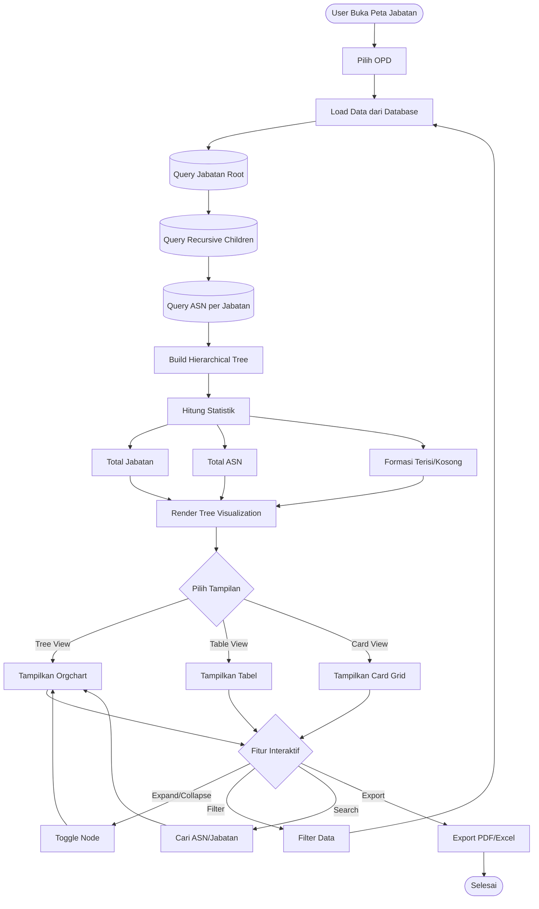
```mermaid
flowchart TD
    Start([User Buka Peta Jabatan]) --> SelectOPD[Pilih OPD]
    SelectOPD --> LoadData[Load Data dari Database]
    
    LoadData --> QueryRoot[(Query Jabatan Root)]
    QueryRoot --> QueryChildren[(Query Recursive Children)]
    QueryChildren --> QueryASN[(Query ASN per Jabatan)]
    
    QueryASN --> BuildTree[Build Hierarchical Tree]
    BuildTree --> CalculateStats[Hitung Statistik]
    
    CalculateStats --> CalcTotal[Total Jabatan]
    CalculateStats --> CalcASN[Total ASN]
    CalculateStats --> CalcFormasi[Formasi Terisi/Kosong]
    
    CalcTotal --> RenderTree[Render Tree Visualization]
    CalcASN --> RenderTree
    CalcFormasi --> RenderTree
    
    RenderTree --> ChooseView{Pilih Tampilan}
    
    ChooseView -->|Tree View| DisplayTree[Tampilkan Orgchart]
    ChooseView -->|Table View| DisplayTable[Tampilkan Tabel]
    ChooseView -->|Card View| DisplayCard[Tampilkan Card Grid]
    
    DisplayTree --> InteractiveFeature{Fitur Interaktif}
    DisplayTable --> InteractiveFeature
    DisplayCard --> InteractiveFeature
    
    InteractiveFeature -->|Expand/Collapse| ToggleNode[Toggle Node]
    InteractiveFeature -->|Filter| ApplyFilter[Filter Data]
    InteractiveFeature -->|Search| SearchASN[Cari ASN/Jabatan]
    InteractiveFeature -->|Export| ExportData[Export PDF/Excel]
    
    ToggleNode --> DisplayTree
    ApplyFilter --> LoadData
    SearchASN --> DisplayTree
    ExportData --> End([Selesai])
```

---

## 3. Use Case Diagram

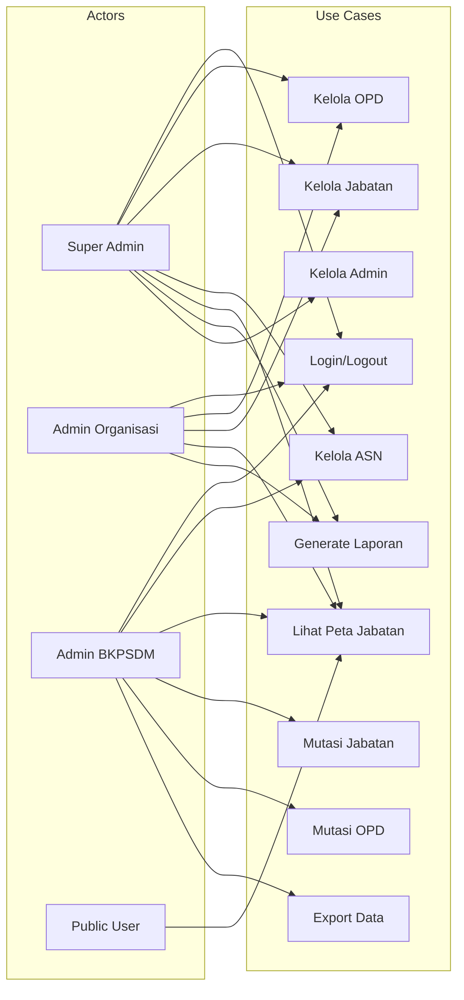
```mermaid
graph LR
    subgraph "Actors"
        SA[Super Admin]
        AO[Admin Organisasi]
        AB[Admin BKPSDM]
        Public[Public User]
    end
    
    subgraph "Use Cases"
        UC1[Login/Logout]
        UC2[Kelola OPD]
        UC3[Kelola Jabatan]
        UC4[Kelola ASN]
        UC5[Lihat Peta Jabatan]
        UC6[Generate Laporan]
        UC7[Kelola Admin]
        UC8[Mutasi Jabatan]
        UC9[Mutasi OPD]
        UC10[Export Data]
    end
    
    SA --> UC1
    SA --> UC2
    SA --> UC3
    SA --> UC4
    SA --> UC5
    SA --> UC6
    SA --> UC7
    
    AO --> UC1
    AO --> UC2
    AO --> UC3
    AO --> UC5
    AO --> UC6
    
    AB --> UC1
    AB --> UC4
    AB --> UC5
    AB --> UC8
    AB --> UC9
    AB --> UC10
    
    Public --> UC5
```

### Use Case Details

| Use Case | Actor | Deskripsi | Precondition |
|----------|-------|-----------|--------------|
| **UC1: Login/Logout** | Semua | Autentikasi pengguna | User terdaftar |
| **UC2: Kelola OPD** | Super Admin, Admin Org | CRUD Organisasi Perangkat Daerah | Login sebagai admin |
| **UC3: Kelola Jabatan** | Super Admin, Admin Org | CRUD Jabatan & Hierarki | OPD sudah ada |
| **UC4: Kelola ASN** | Super Admin, Admin BKPSDM | CRUD data pegawai ASN | Jabatan sudah ada |
| **UC5: Lihat Peta Jabatan** | Semua | Visualisasi struktur organisasi | Data tersedia |
| **UC6: Generate Laporan** | Admin | Generate berbagai jenis laporan | - |
| **UC7: Kelola Admin** | Super Admin | CRUD user admin | - |
| **UC8: Mutasi Jabatan** | Admin BKPSDM | Pindah jabatan ASN | ASN terdaftar |
| **UC9: Mutasi OPD** | Admin BKPSDM | Pindah OPD ASN | ASN terdaftar |
| **UC10: Export Data** | Admin | Export ke PDF/Excel/CSV | Data tersedia |

---

## 4. Activity Diagram

### 4.1 Activity Diagram - Tambah Jabatan Baru

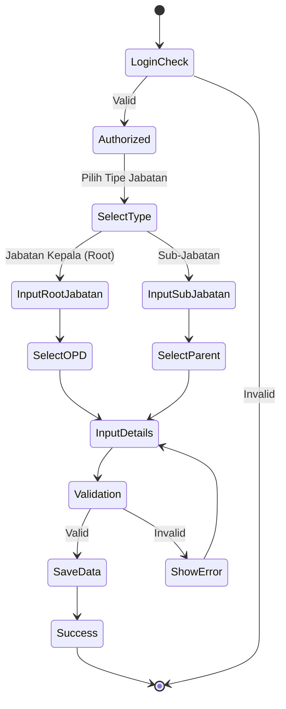
```mermaid
stateDiagram-v2
    [*] --> LoginCheck
    LoginCheck --> Authorized: Valid
    LoginCheck --> [*]: Invalid
    
    Authorized --> SelectType: Pilih Tipe Jabatan
    
    SelectType --> InputRootJabatan: Jabatan Kepala (Root)
    SelectType --> InputSubJabatan: Sub-Jabatan
    
    InputRootJabatan --> SelectOPD
    SelectOPD --> InputDetails
    
    InputSubJabatan --> SelectParent
    SelectParent --> InputDetails
    
    InputDetails --> Validation
    
    Validation --> SaveData: Valid
    Validation --> ShowError: Invalid
    
    ShowError --> InputDetails
    
    SaveData --> Success
    Success --> [*]
```

### 4.2 Activity Diagram - Proses Mutasi ASN

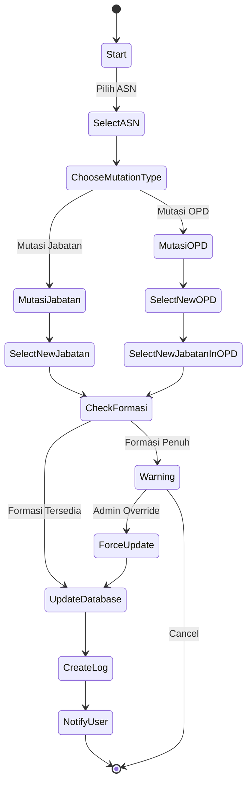
```mermaid
stateDiagram-v2
    [*] --> Start
    Start --> SelectASN: Pilih ASN
    SelectASN --> ChooseMutationType
    
    ChooseMutationType --> MutasiJabatan: Mutasi Jabatan
    ChooseMutationType --> MutasiOPD: Mutasi OPD
    
    MutasiJabatan --> SelectNewJabatan
    SelectNewJabatan --> CheckFormasi
    
    MutasiOPD --> SelectNewOPD
    SelectNewOPD --> SelectNewJabatanInOPD
    SelectNewJabatanInOPD --> CheckFormasi
    
    CheckFormasi --> UpdateDatabase: Formasi Tersedia
    CheckFormasi --> Warning: Formasi Penuh
    
    Warning --> ForceUpdate: Admin Override
    Warning --> [*]: Cancel
    
    ForceUpdate --> UpdateDatabase
    UpdateDatabase --> CreateLog
    CreateLog --> NotifyUser
    NotifyUser --> [*]
```

---

## 5. Sequence Diagram

### 5.1 Sequence Diagram - Tambah OPD Baru

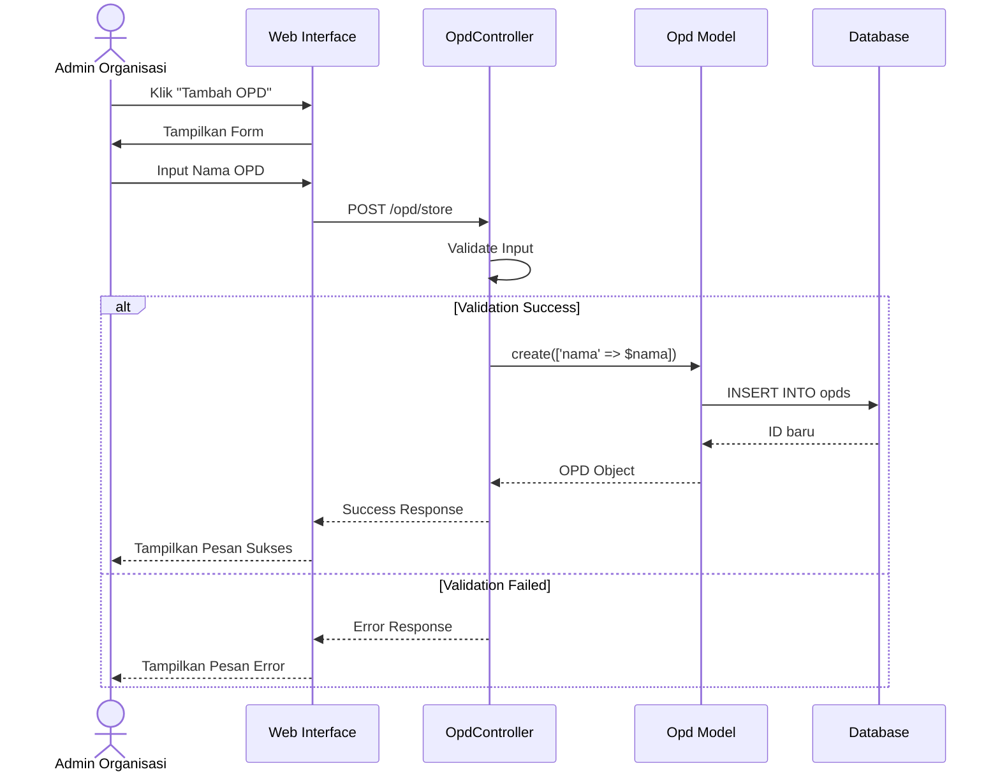
```mermaid
sequenceDiagram
    actor Admin as Admin Organisasi
    participant UI as Web Interface
    participant Controller as OpdController
    participant Model as Opd Model
    participant DB as Database
    
    Admin->>UI: Klik "Tambah OPD"
    UI->>Admin: Tampilkan Form
    Admin->>UI: Input Nama OPD
    UI->>Controller: POST /opd/store
    
    Controller->>Controller: Validate Input
    
    alt Validation Success
        Controller->>Model: create(['nama' => $nama])
        Model->>DB: INSERT INTO opds
        DB-->>Model: ID baru
        Model-->>Controller: OPD Object
        Controller-->>UI: Success Response
        UI-->>Admin: Tampilkan Pesan Sukses
    else Validation Failed
        Controller-->>UI: Error Response
        UI-->>Admin: Tampilkan Pesan Error
    end
```

### 5.2 Sequence Diagram - Generate Peta Jabatan

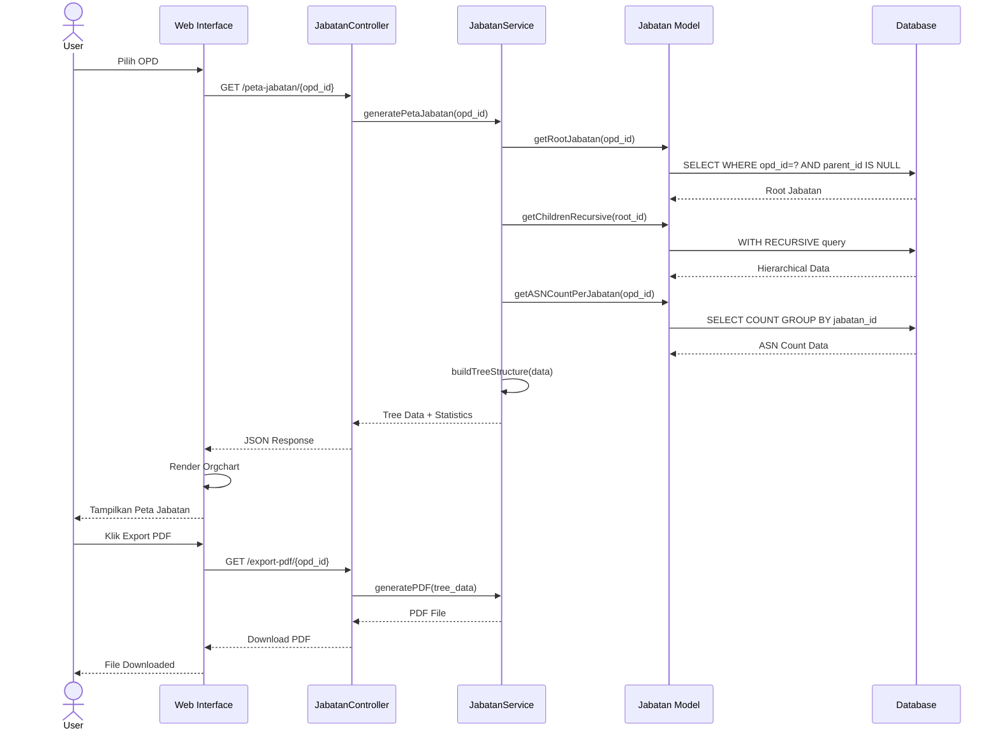
```mermaid
sequenceDiagram
    actor User
    participant UI as Web Interface
    participant Controller as JabatanController
    participant Service as JabatanService
    participant Model as Jabatan Model
    participant DB as Database
    
    User->>UI: Pilih OPD
    UI->>Controller: GET /peta-jabatan/{opd_id}
    Controller->>Service: generatePetaJabatan(opd_id)
    
    Service->>Model: getRootJabatan(opd_id)
    Model->>DB: SELECT WHERE opd_id=? AND parent_id IS NULL
    DB-->>Model: Root Jabatan
    
    Service->>Model: getChildrenRecursive(root_id)
    Model->>DB: WITH RECURSIVE query
    DB-->>Model: Hierarchical Data
    
    Service->>Model: getASNCountPerJabatan(opd_id)
    Model->>DB: SELECT COUNT GROUP BY jabatan_id
    DB-->>Model: ASN Count Data
    
    Service->>Service: buildTreeStructure(data)
    Service-->>Controller: Tree Data + Statistics
    
    Controller-->>UI: JSON Response
    UI->>UI: Render Orgchart
    UI-->>User: Tampilkan Peta Jabatan
    
    User->>UI: Klik Export PDF
    UI->>Controller: GET /export-pdf/{opd_id}
    Controller->>Service: generatePDF(tree_data)
    Service-->>Controller: PDF File
    Controller-->>UI: Download PDF
    UI-->>User: File Downloaded
```

### 5.3 Sequence Diagram - Mutasi ASN ke Jabatan Baru

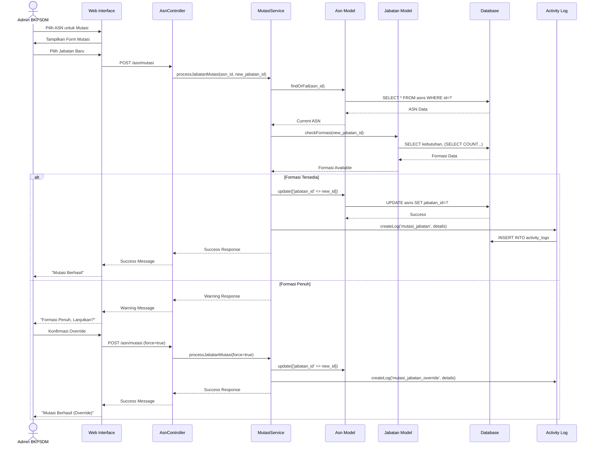
```mermaid
sequenceDiagram
    actor Admin as Admin BKPSDM
    participant UI as Web Interface
    participant Controller as AsnController
    participant Service as MutasiService
    participant AsnModel as Asn Model
    participant JabatanModel as Jabatan Model
    participant DB as Database
    participant Log as Activity Log
    
    Admin->>UI: Pilih ASN untuk Mutasi
    UI->>Admin: Tampilkan Form Mutasi
    Admin->>UI: Pilih Jabatan Baru
    UI->>Controller: POST /asn/mutasi
    
    Controller->>Service: processJabatanMutasi(asn_id, new_jabatan_id)
    
    Service->>AsnModel: findOrFail(asn_id)
    AsnModel->>DB: SELECT * FROM asns WHERE id=?
    DB-->>AsnModel: ASN Data
    AsnModel-->>Service: Current ASN
    
    Service->>JabatanModel: checkFormasi(new_jabatan_id)
    JabatanModel->>DB: SELECT kebutuhan, (SELECT COUNT...)
    DB-->>JabatanModel: Formasi Data
    JabatanModel-->>Service: Formasi Available
    
    alt Formasi Tersedia
        Service->>AsnModel: update(['jabatan_id' => new_id])
        AsnModel->>DB: UPDATE asns SET jabatan_id=?
        DB-->>AsnModel: Success
        
        Service->>Log: createLog('mutasi_jabatan', details)
        Log->>DB: INSERT INTO activity_logs
        
        Service-->>Controller: Success Response
        Controller-->>UI: Success Message
        UI-->>Admin: "Mutasi Berhasil"
    else Formasi Penuh
        Service-->>Controller: Warning Response
        Controller-->>UI: Warning Message
        UI-->>Admin: "Formasi Penuh, Lanjutkan?"
        
        Admin->>UI: Konfirmasi Override
        UI->>Controller: POST /asn/mutasi (force=true)
        Controller->>Service: processJabatanMutasi(force=true)
        Service->>AsnModel: update(['jabatan_id' => new_id])
        Service->>Log: createLog('mutasi_jabatan_override', details)
        Service-->>Controller: Success Response
        Controller-->>UI: Success Message
        UI-->>Admin: "Mutasi Berhasil (Override)"
    end
```

---

## 6. State Diagram

### 6.1 State Diagram - Status Jabatan

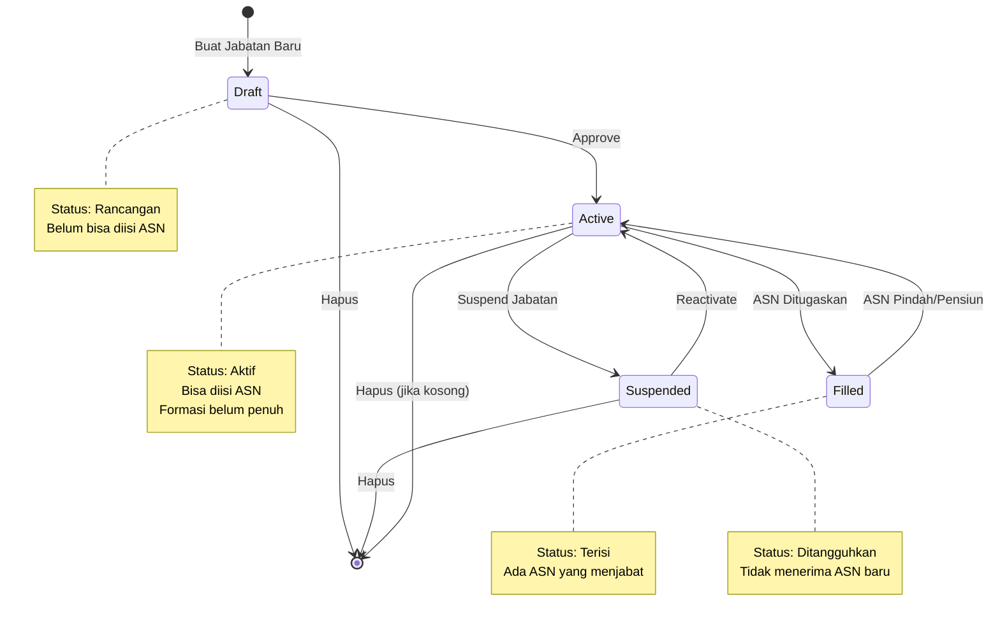
```mermaid
stateDiagram-v2
    [*] --> Draft: Buat Jabatan Baru
    Draft --> Active: Approve
    Draft --> [*]: Hapus
    
    Active --> Filled: ASN Ditugaskan
    Filled --> Active: ASN Pindah/Pensiun
    
    Active --> Suspended: Suspend Jabatan
    Suspended --> Active: Reactivate
    Suspended --> [*]: Hapus
    
    Active --> [*]: Hapus (jika kosong)
    
    note right of Draft
        Status: Rancangan
        Belum bisa diisi ASN
    end note
    
    note right of Active
        Status: Aktif
        Bisa diisi ASN
        Formasi belum penuh
    end note
    
    note right of Filled
        Status: Terisi
        Ada ASN yang menjabat
    end note
    
    note right of Suspended
        Status: Ditangguhkan
        Tidak menerima ASN baru
    end note
```

### 6.2 State Diagram - Siklus Hidup ASN

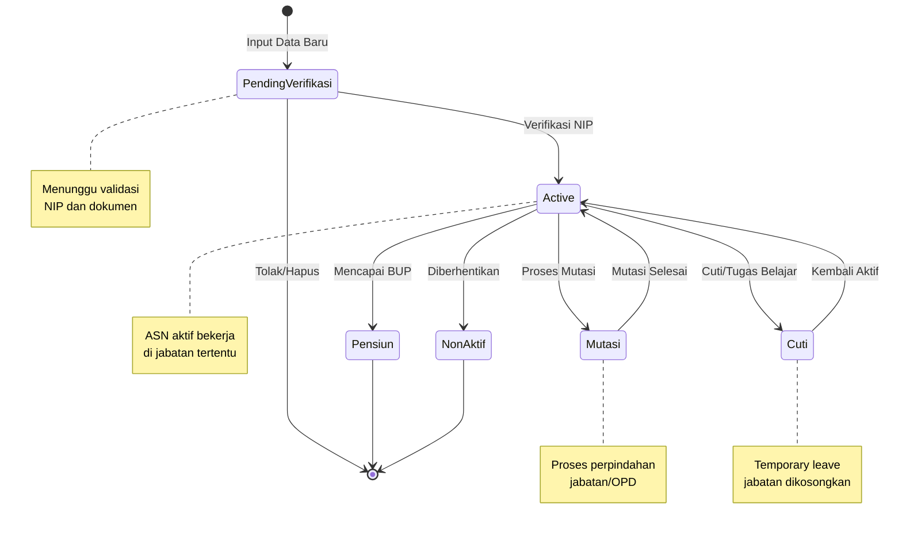
```mermaid
stateDiagram-v2
    [*] --> PendingVerifikasi: Input Data Baru
    PendingVerifikasi --> Active: Verifikasi NIP
    PendingVerifikasi --> [*]: Tolak/Hapus
    
    Active --> Mutasi: Proses Mutasi
    Mutasi --> Active: Mutasi Selesai
    
    Active --> Cuti: Cuti/Tugas Belajar
    Cuti --> Active: Kembali Aktif
    
    Active --> Pensiun: Mencapai BUP
    Active --> NonAktif: Diberhentikan
    
    Pensiun --> [*]
    NonAktif --> [*]
    
    note right of PendingVerifikasi
        Menunggu validasi
        NIP dan dokumen
    end note
    
    note right of Active
        ASN aktif bekerja
        di jabatan tertentu
    end note
    
    note right of Mutasi
        Proses perpindahan
        jabatan/OPD
    end note
    
    note right of Cuti
        Temporary leave
        jabatan dikosongkan
    end note
```

---

## 7. Alur Data Flow Diagram (DFD)

### 7.1 Context Diagram (Level 0)

```
┌─────────────────────┐
│                     │
│   Super Admin       │◄────┐
│                     │     │
└─────────────────────┘     │
                             │
┌─────────────────────┐     │      ┌────────────────────────────────┐
│                     │     │      │                                │
│  Admin Organisasi   │◄────┼──────►    SISTEM SIPETA              │
│                     │     │      │  (Sistem Informasi             │
└─────────────────────┘     │      │   Peta Jabatan ASN)            │
                             │      │                                │
┌─────────────────────┐     │      └────────────────────────────────┘
│                     │     │                    │
│   Admin BKPSDM      │◄────┘                    │
│                     │                          ▼
└─────────────────────┘                 ┌─────────────────┐
                                        │                 │
┌─────────────────────┐                 │  MySQL Database │
│                     │                 │                 │
│   Public User       │◄────────────────┤  - OPDS         │
│                     │                 │  - JABATANS     │
└─────────────────────┘                 │  - ASNS         │
                                        │  - ADMINS       │
                                        └─────────────────┘
```

### 7.2 Data Flow Diagram Level 1

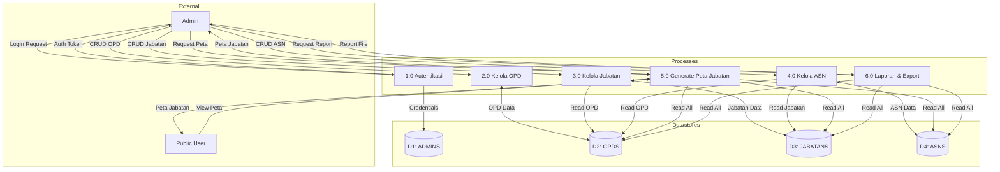
```mermaid
graph TB
    subgraph External
        Admin[Admin]
        User[Public User]
    end
    
    subgraph Processes
        P1[1.0 Autentikasi]
        P2[2.0 Kelola OPD]
        P3[3.0 Kelola Jabatan]
        P4[4.0 Kelola ASN]
        P5[5.0 Generate Peta Jabatan]
        P6[6.0 Laporan & Export]
    end
    
    subgraph Datastores
        D1[(D1: ADMINS)]
        D2[(D2: OPDS)]
        D3[(D3: JABATANS)]
        D4[(D4: ASNS)]
    end
    
    Admin -->|Login Request| P1
    P1 -->|Credentials| D1
    P1 -->|Auth Token| Admin
    
    Admin -->|CRUD OPD| P2
    P2 <-->|OPD Data| D2
    
    Admin -->|CRUD Jabatan| P3
    P3 <-->|Jabatan Data| D3
    P3 -->|Read OPD| D2
    
    Admin -->|CRUD ASN| P4
    P4 <-->|ASN Data| D4
    P4 -->|Read Jabatan| D3
    P4 -->|Read OPD| D2
    
    Admin -->|Request Peta| P5
    User -->|View Peta| P5
    P5 -->|Read All| D2
    P5 -->|Read All| D3
    P5 -->|Read All| D4
    P5 -->|Peta Jabatan| Admin
    P5 -->|Peta Jabatan| User
    
    Admin -->|Request Report| P6
    P6 -->|Read All| D2
    P6 -->|Read All| D3
    P6 -->|Read All| D4
    P6 -->|Report File| Admin
```

---

## 8. Integrasi & API Flow (Future)

### 8.1 Rencana Integrasi Eksternal

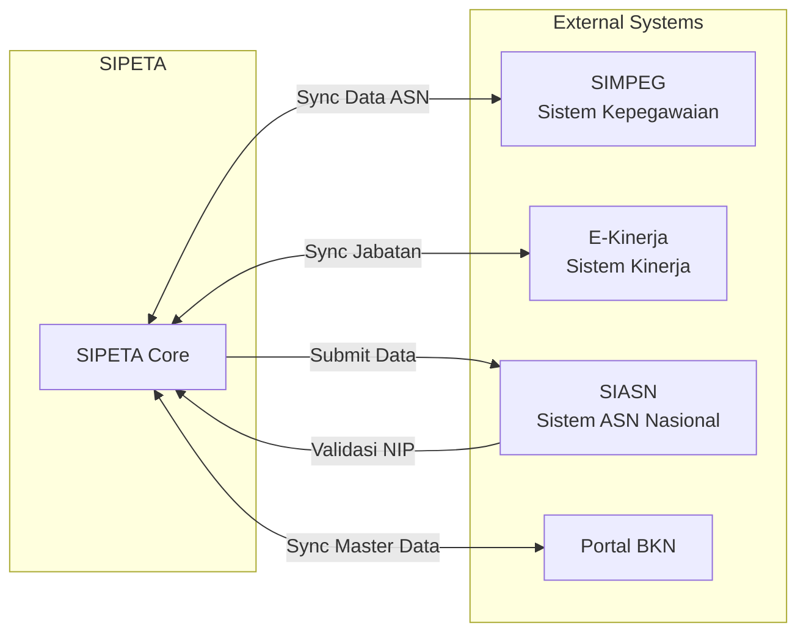
```mermaid
graph LR
    subgraph SIPETA
        A[SIPETA Core]
    end
    
    subgraph "External Systems"
        B[SIMPEG<br/>Sistem Kepegawaian]
        C[E-Kinerja<br/>Sistem Kinerja]
        D[SIASN<br/>Sistem ASN Nasional]
        E[Portal BKN]
    end
    
    A <-->|Sync Data ASN| B
    A <-->|Sync Jabatan| C
    A -->|Submit Data| D
    D -->|Validasi NIP| A
    A <-->|Sync Master Data| E
```

### 8.2 API Endpoints (Rencana)

**Authentication:**
- `POST /api/v1/login` - Login
- `POST /api/v1/logout` - Logout
- `POST /api/v1/refresh` - Refresh Token

**OPD Management:**
- `GET /api/v1/opd` - List all OPD
- `GET /api/v1/opd/{id}` - Get OPD detail
- `POST /api/v1/opd` - Create OPD
- `PUT /api/v1/opd/{id}` - Update OPD
- `DELETE /api/v1/opd/{id}` - Delete OPD

**Jabatan Management:**
- `GET /api/v1/jabatan` - List all Jabatan
- `GET /api/v1/jabatan/{id}` - Get Jabatan detail
- `GET /api/v1/jabatan/tree/{opd_id}` - Get hierarchical tree
- `POST /api/v1/jabatan` - Create Jabatan
- `PUT /api/v1/jabatan/{id}` - Update Jabatan
- `DELETE /api/v1/jabatan/{id}` - Delete Jabatan

**ASN Management:**
- `GET /api/v1/asn` - List all ASN
- `GET /api/v1/asn/{id}` - Get ASN detail
- `POST /api/v1/asn` - Create ASN
- `PUT /api/v1/asn/{id}` - Update ASN
- `DELETE /api/v1/asn/{id}` - Delete ASN
- `POST /api/v1/asn/{id}/mutasi-jabatan` - Mutasi Jabatan
- `POST /api/v1/asn/{id}/mutasi-opd` - Mutasi OPD

**Reporting:**
- `GET /api/v1/report/peta-jabatan/{opd_id}` - Peta Jabatan
- `GET /api/v1/report/formasi` - Laporan Formasi
- `GET /api/v1/report/asn-per-opd` - Laporan ASN per OPD
- `GET /api/v1/export/pdf/{opd_id}` - Export PDF
- `GET /api/v1/export/excel/{opd_id}` - Export Excel

---

## 9. Error Handling Flow

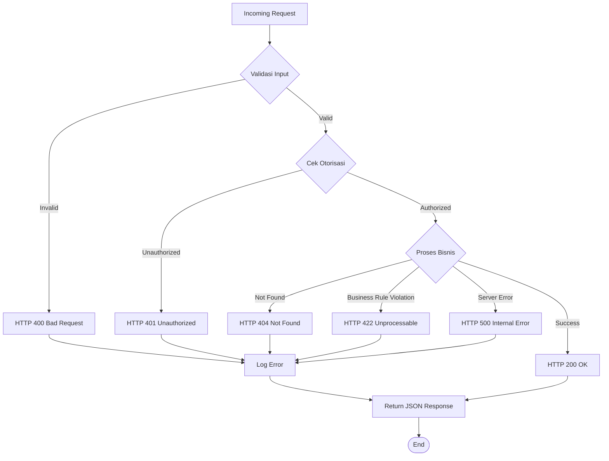
```mermaid
flowchart TD
    Request[Incoming Request] --> Validation{Validasi Input}
    
    Validation -->|Valid| Authorization{Cek Otorisasi}
    Validation -->|Invalid| Error400[HTTP 400 Bad Request]
    
    Authorization -->|Authorized| ProcessBusiness{Proses Bisnis}
    Authorization -->|Unauthorized| Error401[HTTP 401 Unauthorized]
    
    ProcessBusiness -->|Success| Response200[HTTP 200 OK]
    ProcessBusiness -->|Business Rule Violation| Error422[HTTP 422 Unprocessable]
    ProcessBusiness -->|Not Found| Error404[HTTP 404 Not Found]
    ProcessBusiness -->|Server Error| Error500[HTTP 500 Internal Error]
    
    Error400 --> LogError[Log Error]
    Error401 --> LogError
    Error404 --> LogError
    Error422 --> LogError
    Error500 --> LogError
    
    LogError --> ReturnJSON[Return JSON Response]
    Response200 --> ReturnJSON
    
    ReturnJSON --> End([End])
```

---

## 10. Notification Flow (Future Enhancement)

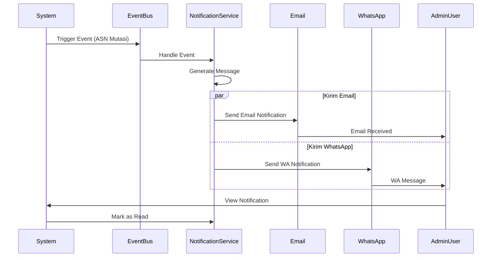
```mermaid
sequenceDiagram
    participant System
    participant EventBus
    participant NotificationService
    participant Email
    participant WhatsApp
    participant AdminUser
    
    System->>EventBus: Trigger Event (ASN Mutasi)
    EventBus->>NotificationService: Handle Event
    NotificationService->>NotificationService: Generate Message
    
    par Kirim Email
        NotificationService->>Email: Send Email Notification
        Email->>AdminUser: Email Received
    and Kirim WhatsApp
        NotificationService->>WhatsApp: Send WA Notification
        WhatsApp->>AdminUser: WA Message
    end
    
    AdminUser->>System: View Notification
    System->>NotificationService: Mark as Read
```

**Event yang Memicu Notifikasi:**
- ASN baru ditambahkan
- Mutasi jabatan/OPD
- Formasi jabatan penuh
- Jabatan baru dibuat
- OPD baru ditambahkan

---

## 11. Backup & Recovery Flow

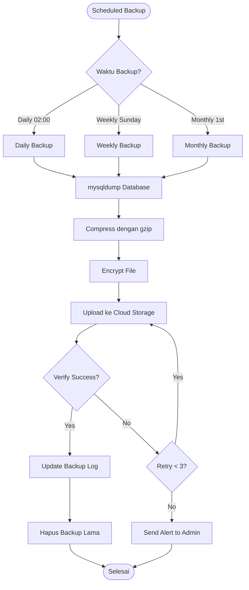
```mermaid
flowchart TD
    Start([Scheduled Backup]) --> CheckTime{Waktu Backup?}
    
    CheckTime -->|Daily 02:00| DailyBackup[Daily Backup]
    CheckTime -->|Weekly Sunday| WeeklyBackup[Weekly Backup]
    CheckTime -->|Monthly 1st| MonthlyBackup[Monthly Backup]
    
    DailyBackup --> DumpDB[mysqldump Database]
    WeeklyBackup --> DumpDB
    MonthlyBackup --> DumpDB
    
    DumpDB --> Compress[Compress dengan gzip]
    Compress --> Encrypt[Encrypt File]
    
    Encrypt --> Upload[Upload ke Cloud Storage]
    Upload --> Verify{Verify Success?}
    
    Verify -->|Yes| UpdateLog[Update Backup Log]
    Verify -->|No| Retry{Retry < 3?}
    
    Retry -->|Yes| Upload
    Retry -->|No| SendAlert[Send Alert to Admin]
    
    UpdateLog --> CleanOld[Hapus Backup Lama]
    CleanOld --> End([Selesai])
    SendAlert --> End
```

**Backup Strategy:**
- **Daily Backup**: Retensi 7 hari
- **Weekly Backup**: Retensi 4 minggu
- **Monthly Backup**: Retensi 12 bulan
- **Location**: Local + Cloud Storage (Google Drive/Dropbox)

---

## 12. Security Flow

### 12.1 XSS & CSRF Protection

```mermaid
flowchart TD
    Request[HTTP Request] --> CheckCSRF{Valid CSRF Token?}
    
    CheckCSRF -->|No| Error419[HTTP 419 Token Mismatch]
    CheckCSRF -->|Yes| SanitizeInput[Sanitize Input]
    
    SanitizeInput --> RemoveXSS[Remove XSS Payload]
    RemoveXSS --> ValidateInput{Input Valid?}
    
    ValidateInput -->|No| Error422[HTTP 422]
    ValidateInput -->|Yes| ProcessRequest[Process Request]
    
    ProcessRequest --> EscapeOutput[Escape Output]
    EscapeOutput --> Response[Return Response]
```

### 12.2 SQL Injection Prevention

```mermaid
flowchart LR
    Input[User Input] --> PreparedStmt[Prepared Statements]
    PreparedStmt --> Eloquent[Eloquent ORM]
    Eloquent --> ParameterBinding[Parameter Binding]
    ParameterBinding --> SafeQuery[(Safe SQL Query)]
    SafeQuery --> Database[(Database)]
```

---

## 📝 Catatan Implementasi

### Technology Stack:
- **Backend**: Laravel 10+ (PHP 8.1+)
- **Frontend**: Blade Templates + Alpine.js / Vue.js
- **Database**: MySQL 8.0+
- **Styling**: Tailwind CSS
- **Charts**: Chart.js / ApexCharts
- **Orgchart**: OrgChart.js / D3.js

### Timeline Estimasi:
1. **Sprint 1 (2 minggu)**: Setup project, authentication, OPD management
2. **Sprint 2 (2 minggu)**: Jabatan management + hierarki
3. **Sprint 3 (2 minggu)**: ASN management + mutasi
4. **Sprint 4 (2 minggu)**: Peta Jabatan visualization + reporting
5. **Sprint 5 (1 minggu)**: Testing, bug fixing, deployment

---

*Dokumentasi dibuat: 20 November 2025*  
*Sistem: SIPETA (Sistem Informasi Peta Jabatan ASN)*  
*Versi: 1.0*
